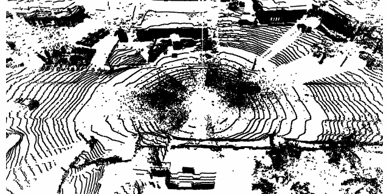
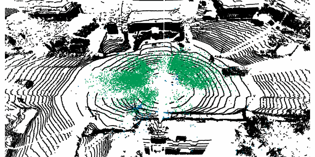
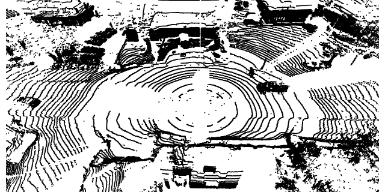

# Snow Removal for LiDAR Point Clouds with Spatio-temporal Conditional Random Fields (CRFOR)

This is the offical implementation of [Snow Removal for LiDAR Point Clouds with Spatio-temporal Conditional Random Field].

- Results for [WADS](https://digitalcommons.mtu.edu/wads/) are as follows.
  
- original point cloud.
- 

- colored by result, red(False Negetive), green(False Positive), blue(True Positive), black(True Negative).
- 

- de-snowed point cloud.
- 

## Requirements
- numpy
- sklearn
- open3d

## Evaluate
run
```
python CRFOR.py
```
or
```
python CRFOR_t.py
```

## Citation
```
@article{wang2023snow,
  title={Snow Removal for LiDAR Point Clouds With Spatio-Temporal Conditional Random Fields},
  author={Wang, Weimin and Yang, Ting and Du, Yu and Liu, Yu},
  journal={IEEE Robotics and Automation Letters},
  year={2023},
  publisher={IEEE}
}
```
